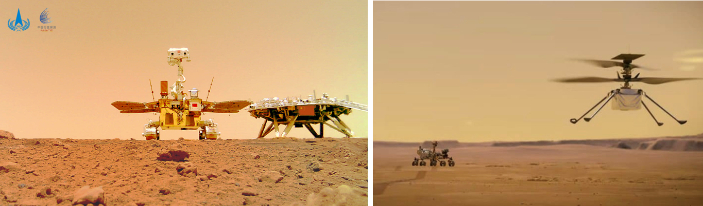
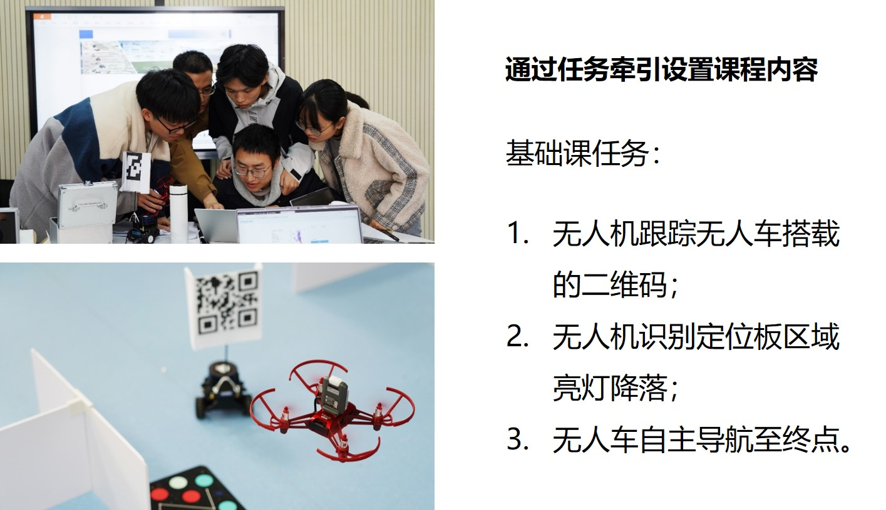

2023-10-05：[课程样例2.1b、2.6、2.7](课程样例)更新。

2023-01-02：[课程样例](课程样例)更新。

2022-12-26：课程[仿真环境](https://github.com/npu-ius-lab/npurobocourse_sim)发布。
***
# 智能无人系统综合设计 I (U38L81001)
西北工业大学 无人系统技术研究院

校级一流本科课程

大疆创新-教育部产学合作协同育人项目（2021-2023）

我国“祝融号”和美国“毅力号”均成功登陆火星开始了新一轮的探索。

为什么火星车能自主避障行驶？

为什么无人机能协同提供支持？

什么是快乐星球，现在就带你研究！

《智能无人系统综合设计》以机器人操作系统（ROS）为软件平台，结合智能无人机、无人车等硬件设备，融合多学科知识内容，探索竞赛项目牵引、理论实践结合、重视团队合作的“人工智能+无人系统”教学模式。

课程分为基础课（I）和进阶课（II）两个阶段，每阶段均包括理论课程、实验课程、综合实践三个环节。基础课（I）课程安排：[课程大纲](课程大纲)。进阶课（II）课程安排参见仓库其他分支。

参考资料及代码示例：[参考资料](参考资料)。

课件及实验手册样例：[课程样例](课程样例)。

感谢历届助教同学：[助教名单](助教名单)。

欢迎选报《智能无人系统综合设计 I》，课程代码：U38L81001。

课程内容未经允许不得商用。

欢迎交流，联系方式：yangtao@nwpu.edu.cn
