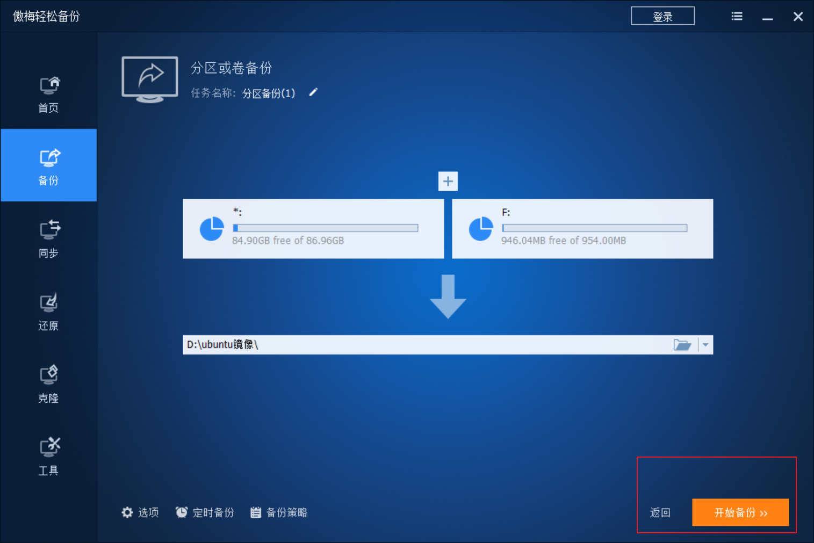

# Ubuntu20.04/ROS 系统盘制作

## 1. 安装—傲梅轻松备份
🎉下载页面：https://www.abackup.com/easy-backup-personal.html

**安装完成后，打开界面如下：**

## 2. 下载系统镜像文件
**镜像文件链接（Ubuntu 20.04 + ROS Noetic）：**
https://pan.baidu.com/s/1NG730Wo9OFFNIwm68pKtzg?pwd=nhtm 提取码: nhtm 

## 3. 选择”还原“,择下载的镜像文件

## 4. 首先选择”*：“（系统分区）：

## 5. 选择U盘：

**选择确定：**

**开始还原：**

**等待系统还原：**
该过程用时取决于U盘速度，一般建议使用固态U盘。

**还原完成**

## 6. 重复步骤3

## 7. 再次选择”G：“（EFI分区）##

## 9. 选择”未分配“：

**选择”下一步“，等待还原完成，最后制作成功：**

# Ubuntu系统镜像制作

# 1. 选择备份（示例选择”分区备份“）

**选择”分区备份“**

# 2. 点击添加分区

**单机”添加“**

# 3.点击”开始备份“
**等待备份完成**
