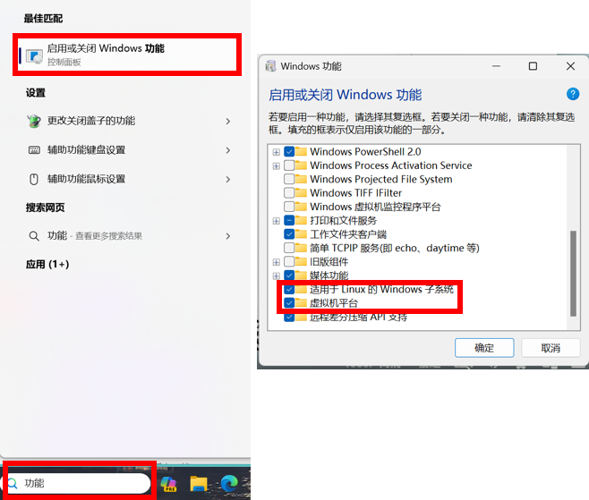

# 在 WSL 中进行 ROS 开发

## 准备工作

**1. 确认虚拟化已开启**

- 在任务管理器中，选择**性能**，查看虚拟化是否已开启。

  - 

**2. 开启 wsl 功能**

- 打开“启动或关闭 Windows 功能”窗口，勾选以下选项：
  - 适用于 Linux 的 Windows 子系统
  - 虚拟机平台（非必须）
- 

**3. 重启电脑**

## 下载 Ubuntu 20.04

**1. 打开 Microsoft Store**

- 搜索 **Ubuntu**，下载并安装 **Ubuntu 20.04.6 LTS**。
- 

**2. 打开 Ubuntu 20.04**

- 下载完成后，可以从开始菜单或者 Windows 搜索栏中启用 Ubuntu 20.04。

**3. 初始化 Ubuntu**

- 等待初始化完成（`Installing, this may take a few minutes…`），然后设置**用户名 (username)** 和 **密码 (password)**。

**4. 完成安装**

- 安装完成后，等待出现 **Welcome to Ubuntu 20.04.6 LTS** 字样，表示安装成功。
- 此时打开 Windows 资源管理器，在左侧能看到 Ubuntu 图标（或在地址栏输入：\\\wsl$），并查看 Ubuntu 文件。

## 安装 ROS

- 在 Ubuntu 终端输入以下命令，按提示安装 ROS Noetic：
  
  ```bash
  wget http://fishros.com/install -O fishros && . fishros
  ```

## 安装 Visual Studio Code

- 在 Windows 下安装 **Visual Studio Code**

- 安装完成后，在 Ubuntu 终端输入以下命令打开 VS code，并查看 Ubuntu 文件：
  
  ```bash
  code .
  ```

## 安装 terminator

- Ubuntu 终端中输入：
  ```bash
  sudo apt install terminator
  ```
- Ubuntu 终端中输入：
  ```bash
   terminator
  ```
   可以在打开的终端窗口中使用 Ubuntu 快捷键以标签形式开启终端。


## 注意事项

- 如果无法打开 RViz、Gazebo 等图像化界面，请在 Windows cmd 中输入以下命令更新：
  
  ```bash
  wsl --update
  ```
  
  更新完成后重新打开 Ubuntu 终端。

- 如果无人机图像无法显示，请关闭**防火墙。**

- 如果 VS Code 无法打开，请在 VS Code插件中搜索 **WSL** 并下载，通过远程连接到 Linux 桌面。

## 参考资料

- [超详细的WSL教程：Windows上的Linux子系统_哔哩哔哩_bilibili](https://www.bilibili.com/video/BV1tW42197za/?spm_id_from=333.1007.top_right_bar_window_history.content.click&vd_source=6d0b706676e3d39f9a5901aeb336cb8b)

- [firefox - How to run GUI apps with Windows Subsystem for Linux - Super User](https://superuser.com/questions/1580610/how-to-run-gui-apps-with-windows-subsystem-for-linux)

- [鱼香ROS机器人](https://fishros.com/)
